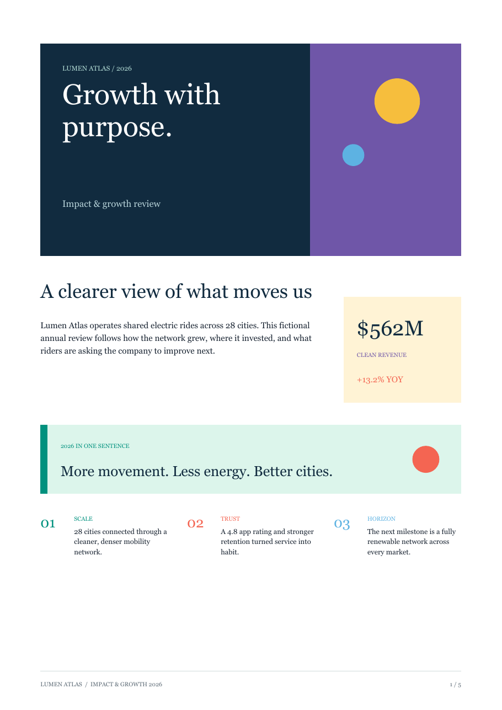
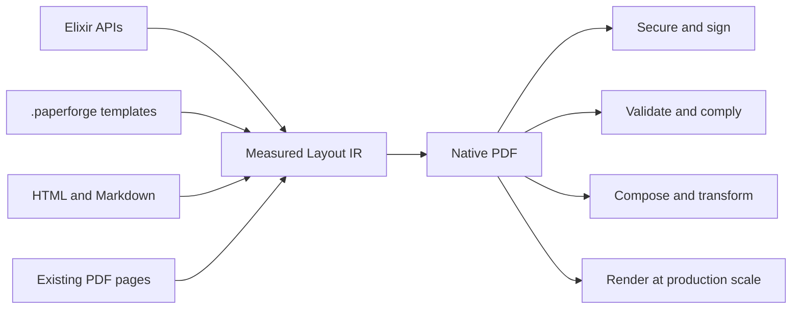
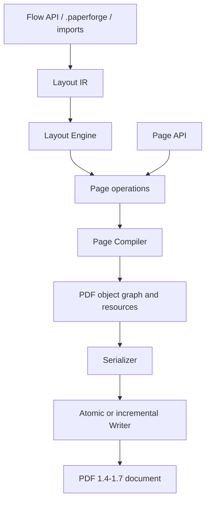

# PaperForge

> **Document engineering for the BEAM.**
>
> Build, secure, validate, and transform documents entirely in Elixir.

## Project Status

| Signal | Status |
| --- | --- |
| Public API | Stable `1.x` compatibility contract |
| Production use | Ready within the [documented scope](#scope-boundaries) |
| Package | Published on [Hex](https://hex.pm/packages/paper_forge) |
| Documentation | Published on [HexDocs](https://paper-forge.hexdocs.pm/) |
| Continuous integration | Formatting, strict compilation, and the full test suite on [GitHub Actions](https://github.com/Manuel1471/paper_forge/actions) |
| Performance | Reproducible latency, memory, and concurrency benchmarks |
| Runtime | Pure Elixir; no installation-time native compilation |

[](https://github.com/Manuel1471/paper_forge/blob/main/examples/paper_forge_1_4_showcase.exs)

The report above is native PDF output from the maintained
[`paper_forge_1_4_showcase.exs`](https://github.com/Manuel1471/paper_forge/blob/main/examples/paper_forge_1_4_showcase.exs) example.
The same engine also powers reusable
[`.paperforge` templates](https://github.com/Manuel1471/paper_forge/blob/main/examples/paper_forge_1_4_showcase.paperforge) and
[scientific documents](https://github.com/Manuel1471/paper_forge/blob/main/examples/investigacion.paperforge).

PaperForge is a document platform for Elixir applications. It turns structured
content into native PDF object graphs, measured layouts, interactive forms,
secure deliverables, imported documents, and production rendering workflows.

No browser, wkhtmltopdf, Chromium, ImageMagick, Ghostscript, or external
rendering service is required.

PaperForge 1.4 provides a stable public API for pure-Elixir PDF authoring,
versioned declarative templates, reusable design systems, AES-256 document
security, PAdES digital signatures, tamper-evident protection, tagged PDF output, bounded concurrent
rendering, production telemetry, and reproducible performance tooling.
Documented public modules follow Semantic Versioning throughout the 1.x series.

## Performance Snapshot

Reference large-document profile on Elixir 1.20.2, OTP 29, 10 schedulers,
`MIX_ENV=prod`, 2 warmups, and 10 measured samples:

| Input | Output | Median total | Median layout | Peak process memory |
| ---: | ---: | ---: | ---: | ---: |
| 5,000 table rows | 179 pages / 616,018 bytes | 766.95 ms | 717.66 ms | approximately 81 MB |

These are reference measurements, not cross-machine guarantees. See
[Performance Envelope](#performance-envelope) for the runner, methodology,
p95 values, concurrency profiles, and reproduction commands.

## One Engine, Complete Document Lifecycle



Use the high-level `PaperForge.Flow` API for paginated documents, the
declarative `.paperforge` format for reusable templates, or `PaperForge.Page`
for precise drawing. All three paths converge on the same PDF-native engine.

## Start Here

| Goal | Start with |
| --- | --- |
| Install and render a first PDF | [Installation](#installation) and [Quick Start](#quick-start) |
| Use PaperForge in a Phoenix application | [Phoenix Quick Start](#phoenix-quick-start) and [`PHOENIX.md`](PHOENIX.md) |
| Build reports, invoices, or contracts | [Document Authoring](#document-authoring) |
| Build PDFs from reusable data templates | [Declarative Documents](#declarative-documents) |
| Import HTML, Markdown, or PDF pages | [Import, Science, Forms, And Review](#import-science-forms-and-review) and [`INTEROPERABILITY.md`](INTEROPERABILITY.md) |
| Build formulas and scientific reports | [`SCIENTIFIC.md`](SCIENTIFIC.md) |
| Encrypt, sign, or protect documents | [Security And Protection](#security-and-protection) |
| Prepare accessible or archival PDFs | [Compliance And Accessibility](#compliance-and-accessibility) |
| Draw at exact coordinates | [Low-level Page API](#low-level-page-api) |
| Configure fonts and Unicode | [Fonts And Unicode Text](#fonts-and-unicode-text) |
| Add JPEG, PNG, or fitted images | [Images](#images) |
| Generate many PDFs safely | [Concurrent Rendering](#concurrent-rendering) |
| Instrument production renders | [Telemetry](#telemetry) |
| Reproduce performance measurements | [Performance Envelope](#performance-envelope) |
| Understand the internal pipeline | [`ARCHITECTURE.md`](ARCHITECTURE.md) |
| Review stable public modules | [`API.md`](API.md) |
| Upgrade an existing application | [`MIGRATING.md`](MIGRATING.md) |
| Deploy and size production workloads | [`PRODUCTION.md`](PRODUCTION.md) |

## Why PaperForge?

PaperForge was built around a simple idea: document generation should be a
first-class capability of the BEAM. Elixir applications should not need a
browser, an external rendering service, or a platform-specific binary to
produce professional documents.

Every layer, from measured layout and declarative templates to signatures,
accessibility preparation, scientific notation, and bounded production
rendering, is designed to remain deterministic, composable, and natural to
operate inside an Elixir system.

PaperForge exists because generating professional PDF documents should not
require browsers, external rendering engines, or native compilation.

## Design Principles

- **Deterministic output.** Identical immutable input produces reproducible
  document structure within the same PaperForge version.
- **Pure Elixir runtime.** The default generation and signing paths do not
  require native compilation or system executables.
- **Production first.** Validation, bounded concurrency, telemetry, resource
  limits, and explicit failure modes are part of the design.
- **Document semantics.** Text, navigation, forms, annotations, attachments,
  and accessibility structures remain native PDF objects.
- **Stable public APIs.** Documented `1.x` modules follow Semantic Versioning
  and explicit deprecation policy.

## Designed For

Financial reports, contracts, invoices, government and institutional forms,
scientific papers, internal dashboards, certificates, statements, and other
documents that need repeatable layout or PDF-native behavior.

## Compatibility

| Surface | Supported or tested range |
| --- | --- |
| Elixir | `~> 1.20` |
| Erlang/OTP | OTP 29 in CI |
| PDF headers | PDF 1.4 through PDF 1.7 |
| Runtime installation | BEAM dependencies only by default |

## Why Not Just HTML?

HTML-to-PDF tools are a good fit when a browser rendering model is the desired
source of truth. PaperForge takes a different approach for applications that
need deterministic paged layout and direct access to PDF capabilities.

| Concern | Typical browser HTML-to-PDF pipeline | PaperForge |
| --- | --- | --- |
| Browser process | Usually required | Not required |
| Platform executable | Usually required | Not required by default |
| Layout model | Browser and print CSS | Deterministic document Layout IR |
| Runtime language | Mixed process boundary | Pure Elixir generation path |
| PDF-native structures | Often require post-processing | Built into the document model |
| Forms, annotations, attachments, signatures | Usually separate tooling | First-class APIs |

## Ecosystem

```text
PaperForge
|-- Core document and PDF engine
|-- Flow and Page APIs
|-- .paperforge declarative templates
|-- HTML, Markdown, SVG, and PDF import
|-- Security, signatures, and compliance preparation
|-- Scientific documents and Math AST
`-- Production concurrency, telemetry, and benchmarks

Future directions
|-- Visual Template Studio
|-- Extended interoperability
`-- Distributed generation patterns
```

## Capability Overview

| Area | Included capabilities |
| --- | --- |
| Layout | Unified flow, automatic pagination, keep controls, widow/orphan control, grids, columns, reusable components, and diagnostics |
| Templates | Named and inherited templates, sections, margins, headers, footers, page variants, and total page counts |
| Tables | Wrapped cells, measured row heights, repeated headers, row policies, multipage splitting, `colspan`, `rowspan`, borders, and vertical alignment |
| Typography | Standard PDF fonts, embedded TrueType, physical subsetting, real metrics, font families, Unicode maps, rich text, alignment, justification, and deterministic hyphenation |
| Navigation | Linked tables of contents, internal links, named destinations, page-aware references, outlines, and bookmarks |
| Images | JPEG and PNG, alpha soft masks, EXIF orientation, deduplication, `:contain`/`:cover`, focal points, alignment, and numbered captions |
| Graphics | Lines, rectangles, circles, scientific charts, QR codes, barcodes, and SVG paths, curves, transforms, groups, viewBox, clipping, styles, and text |
| Interoperability | CommonMark Markdown and an HTML/CSS subset to Layout IR, classic PDF page import, ordered composition, and reusable resource inventories |
| Scientific documents | Native Math AST, fractions, roots, matrices, integrals, numbered equations, bibliography entries, citations, footnotes, and page-aware references |
| PDF features | AcroForm fields and data workflows, review annotations, metadata, links, attachments, footnotes, endnotes, compression, and PDF 1.4 through 1.7 headers |
| Security | AES-256 passwords and permissions, provider-backed PAdES signatures, watermarks, fingerprints, identifiers, and link/attachment policies |
| Accessibility and archive preparation | Tagged PDF structure, logical page reading order, language, alternate text metadata, XMP, PDF/UA-1 preparation, ICC output intents, and PDF/A-2b/3b preparation |
| Production | Structured validation, deterministic output, incremental file writing, bounded concurrency, retries, resource limits, cancellation, and Telemetry |
| Declarative authoring | Versioned `.paperforge` templates, typed variables, conditions, loops, components, Layout IR compilation, themes, tokens, and shared design libraries |

## Choose An API

| Use case | API |
| --- | --- |
| Reports, invoices, statements, and contracts | Build blocks with `PaperForge.Flow`, then call `PaperForge.layout/3` |
| Exact coordinates, labels, or custom graphics | `PaperForge.Page` |
| Return a PDF binary for HTTP or object storage | `PaperForge.to_binary/1` |
| Write a large PDF with lower serialization overhead | `PaperForge.write/2` or `write!/2` |
| Write an encrypted PDF | `PaperForge.write/3` with `security:` options |
| Sign a PDF with a certificate | `PaperForge.Signature.sign/2` or `sign_file/3` |
| Add watermarks and resource policy | `PaperForge.protect/2` |
| Prepare and validate PDF/A or PDF/UA structure | `PaperForge.comply/2` and `PaperForge.Compliance.validate/2` |
| Render a finite batch and collect all results | `PaperForge.Concurrent.run/3` |
| Consume a backpressured production queue lazily | `PaperForge.Concurrent.stream/4` |
| Start a cancellable asynchronous render | `PaperForge.Concurrent.start_job/4` |
| Inspect layout decisions and overflow | `PaperForge.debug/2` |
| Maintain an application built on legacy helpers | `add_flow/4` and `add_table/4` |

## Import, Science, Forms, And Review

PaperForge 1.4 can turn CommonMark or a practical HTML/CSS subset into the same
Layout IR used by native `Flow` blocks. It can also import pages from classic,
unencrypted PDFs, compose documents in order, and inventory reusable resources.

```elixir
{:ok, intro} = PaperForge.Import.markdown("# Study results\n\nMeasured in Elixir.")
{:ok, appendix} = PaperForge.Import.html("<h2>Appendix</h2><p>Imported HTML.</p>")
{:ok, combined} = PaperForge.Interoperability.compose([first_pdf, second_pdf])
```

Imported tables have readable defaults but remain CSS-configurable. The safe
subset supports element, class, and ID selectors plus practical table styling:

```html
<style>
  table {
    width: 100%;
    border-color: #ccd9d7;
    border-width: 0.5pt;
    border-collapse: collapse;
  }

  th {
    color: #ffffff;
    background-color: #173f52;
    padding: 8pt;
    text-align: left;
    vertical-align: middle;
  }

  td {
    color: #243b46;
    padding: 7pt;
    line-height: 12pt;
    vertical-align: middle;
  }

  tr:nth-child(even) {
    background-color: #f0f7f5;
  }
</style>
```

Supported table declarations include foreground and background colors,
font size and style, alignment, vertical alignment, padding, line height,
width, border color, border width, border style, border collapse, margins,
and even-row striping. Browser layout features such as flexbox, CSS Grid,
positioned elements, scripts, and complex pseudo-elements are intentionally
outside the deterministic paged-document subset.

The wider HTML importer also supports practical document CSS:

- Element, `.class`, `#id`, `element.class`, `element#id`, and universal
  selectors, with inline declarations taking precedence.
- Text color, backgrounds, built-in PDF font families, font size, weight,
  style, alignment, text transformation, line height, and hyphenation.
- Width, `max-width`, height, padding, vertical margins, border color, border
  width, and `border-style: none` or visible borders.
- `display: none`, `visibility: hidden`, list marker selection, widow and
  orphan limits, and `break-before`, `break-after`, or `break-inside` controls.
- Image sizing plus `object-fit: contain | cover | fill` and common
  `object-position` combinations.
- Legacy `page-break-*` declarations as aliases for paged-media break rules.

Block backgrounds, borders, and padding are rendered as native PDF geometry;
they are not flattened screenshots. Unsupported declarations fail in strict
mode or are ignored when `strict_css: false` is selected explicitly.

Scientific documents use a native Math AST rather than screenshots. Fractions,
roots, matrices, scripts, and integrals remain selectable PDF vectors and text.
`PaperForge.Scientific` adds equation numbering, page-aware references,
citations, and bibliographies around the existing footnote and TOC engine.

Standard interactive forms are available through `PaperForge.AcroForm`, with
text fields, checkboxes, push buttons, radio groups, list boxes, combo boxes,
signature fields, defaults, appearances, restricted calculations, data
import/export, and flattening. XFA is intentionally unsupported.

Review workflows can add text notes, highlights, underline and strikeout
markup, stamps, free text, shapes, ink, file attachments, links, authorship,
subjects, and reply relationships. See [`INTEROPERABILITY.md`](INTEROPERABILITY.md)
and [`SCIENTIFIC.md`](SCIENTIFIC.md) for complete examples and supported limits.

## Installation

Add PaperForge to your dependencies:

```elixir
def deps do
  [
    {:paper_forge, "~> 1.4"}
  ]
end
```

Then run:

```bash
mix deps.get
```

To use the GitHub release directly:

```elixir
def deps do
  [
    {:paper_forge,
     github: "Manuel1471/paper_forge",
     tag: "v1.4.0"}
  ]
end
```

For local development against `main`:

```elixir
def deps do
  [
    {:paper_forge,
     github: "Manuel1471/paper_forge",
     branch: "main"}
  ]
end
```

## Quick Start

```elixir
alias PaperForge.Flow

{document, report} =
  PaperForge.new(compress: true, pdf_version: "1.7")
  |> PaperForge.page_template(
    :default,
    size: :a4,
    margins: [top: 72, right: 54, bottom: 72, left: 54],
    header: "Quarterly Report",
    footer: "Page {page} of {total}"
  )
  |> PaperForge.layout(
    fn flow ->
      flow
      |> Flow.heading("Quarterly Report", level: 1)
      |> Flow.paragraph("""
      PaperForge measures, paginates, and renders document blocks automatically.
      """)
      |> Flow.list(
        ["Unified layout", "Automatic pagination", "Reusable templates"],
        type: :unordered
      )
      |> Flow.table(
        ["Metric", "Value"],
        [
          ["Revenue", "$120K"],
          ["Margin", "24%"]
        ],
        repeat_header: true
      )
    end,
    template: :default
  )

IO.inspect(report.pages, label: "Pages")
PaperForge.write!(document, "report.pdf")
```

## Phoenix Quick Start

PaperForge runs inside a Phoenix application like any other Elixir library. It
does not require a browser process, command-line renderer, native executable,
or separate document service.

Add `{:paper_forge, "~> 1.4"}` to the Phoenix application's dependencies, run
`mix deps.get`, and return the generated binary from a controller:

```elixir
def download(conn, %{"id" => id}) do
  document = MyApp.Documents.build_report(id)
  pdf = PaperForge.to_binary(document)

  conn
  |> put_resp_content_type("application/pdf")
  |> put_resp_header("content-disposition", ~s(attachment; filename="report-#{id}.pdf"))
  |> send_resp(:ok, pdf)
end
```

Use direct binary responses for small and medium documents. For large reports
or burst traffic, render through a bounded `Task.Supervisor` or an optional
Oban queue, write to temporary storage, upload the completed artifact, and let
Phoenix serve or redirect to the stored file.

The complete guide covers routes, controllers, `.paperforge` templates,
LiveView downloads, supervision, Oban, security, Telemetry, testing, and
production limits in [`PHOENIX.md`](PHOENIX.md).

## Declarative Documents

PaperForge 1.4 separates document design from application code. A versioned
`.paperforge` JSON file defines variables, conditions, loops, reusable
components, styles, themes, and shared layouts. The safe compiler validates
input data and produces `PaperForge.Flow` Layout IR without evaluating Elixir
source.

### Why Use `.paperforge`?

Use it when the document design should be editable independently from the
application: invoices maintained by operations, reports reused across teams,
or customer documents generated from changing data. A template describes the
document, JSON supplies the changing information, and reusable component files
keep repeated sections consistent. Most authors only need to understand the
document they want to build, not Elixir or PDF internals.

Start with one template, declare its variables, arrange blocks, and move any
repeated section into `kind: "component"` files. Validate everything with
`mix paper_forge.validate` before generating PDFs.

For a complete plain-language walkthrough, read
[`PAPERFORGE_TEMPLATES.md`](PAPERFORGE_TEMPLATES.md). The exhaustive format and
security reference remains in [`DECLARATIVE.md`](DECLARATIVE.md).

```json
{
  "version": "1",
  "variables": {
    "customer": {"type": "string", "required": true},
    "items": {"type": "list", "required": true}
  },
  "blocks": [
    {"type": "heading", "text": "Invoice for {{customer}}"},
    {
      "for": "item in items",
      "blocks": [
        {"type": "paragraph", "text": "{{item.name}} - {{item.total}}"}
      ]
    }
  ]
}
```

```elixir
with {:ok, template} <- PaperForge.Declarative.load("invoice.paperforge"),
     {:ok, document, report} <- PaperForge.Declarative.render(template, invoice_data),
     :ok <- PaperForge.write(document, "invoice.pdf") do
  IO.inspect(report.pages, label: "Pages")
end
```

Declarative templates may also define security policy, protection, and
compliance. Signature metadata may be declared too. User and owner passwords
can live directly in a controlled `.paperforge` template:

```json
"security": {
  "algorithm": "aes_256",
  "user_password": "reader-secret",
  "owner_password": "owner-secret",
  "permissions": {"copy": false, "modify": false}
}
```

Passwords stored this way are plain text. Shared and production templates
should normally inject secrets when writing; runtime values override template
values:

```elixir
PaperForge.Declarative.write(template, data, "contract.pdf",
  security: [
    user_password: "reader-secret",
    owner_password: System.fetch_env!("PDF_OWNER_PASSWORD")
  ]
)
```

`PaperForge.DesignSystem` provides immutable tokens, named styles, visual
components, shared layouts, mergeable libraries, and themes with inheritance.
Inline design definitions can extend an application-owned design library and
override selected values per template.

Production templates may also import design libraries, include document
fragments, invoke application-registered trusted components, validate nested
data constraints, and use comparison and boolean expressions. Imports and
local resources are confined to an explicit root; expansion, data, table, and
file-size limits are configurable.

Semantic validation errors identify the source file, exact line and column,
JSON path, stable error code, and a human-readable explanation. When a separate
data JSON file is used, errors point to that file instead of the template.

Visual components do not require Elixir. Put each component in a readable
`.paperforge` file and list it from the document:

```json
{
  "version": "1",
  "components": ["components/metrics_section.paperforge"],
  "blocks": [
    {
      "component": "metrics_section",
      "props": {"title": "Performance", "metrics": "{{metrics}}"}
    }
  ]
}
```

Component files declare `kind: "component"`, a name, typed props, optional
slots and variants, and ordinary blocks. They may import other component files,
which makes complete design libraries possible without application code.

Validate templates in CI without producing a PDF:

```bash
mix paper_forge.validate templates/report.paperforge data/report.json \
  --root templates --reject-unknown-data
```

The packaged JSON Schema is available through
`PaperForge.Declarative.schema_path/0`. Compiled templates expose a stable
`template_id` and SHA-256 `template_hash`; `compile_cached/3` provides a bounded
process-local cache for templates that do not use registered Elixir components.

See [`DECLARATIVE.md`](DECLARATIVE.md) for the complete format, validation
contract, supported blocks, trust boundary, and design-system API.

PaperForge 1.4 templates can also import supported HTML and Markdown, declare
native Math AST equations, references, notes, bibliographies, common review
annotations, and root-level AcroForms. PDF page import and whole-document
composition remain explicit application operations through
`PaperForge.Interoperability`; templates cannot open arbitrary PDF files.

## Security And Protection

PaperForge emits a PDF Standard Security Handler using AES-256, revision 6.
Passwords, salts, initialization vectors, and derived keys exist only during
serialization; they are never stored in `PaperForge.Document` or a compiled
`.paperforge` template.

```elixir
PaperForge.write!(document, "contract.pdf",
  security: [
    user_password: "reader-secret",
    owner_password: System.fetch_env!("PDF_OWNER_PASSWORD"),
    permissions: [
      print: :high_resolution,
      copy: false,
      modify: false,
      extract: false
    ]
  ]
)
```

`PaperForge.protect/2` is independent from encryption. It can add a watermark,
a deterministic document identifier and SHA-256 content fingerprint, then
enforce allowed URI schemes/hosts and attachment count, size, and MIME rules
before output:

```elixir
document =
  PaperForge.protect(document,
    watermark: [text: "CONFIDENTIAL", opacity: 0.12, angle: 35],
    policy: [
      allowed_uri_schemes: ["https", "mailto"],
      allow_attachments: true,
      max_attachment_bytes: 5_000_000,
      allowed_attachment_mimes: ["application/pdf", "text/csv"]
    ]
  )

:ok = PaperForge.Protection.verify_fingerprint(document)
```

Passwords should come from a secret manager or environment at the final write
boundary. Do not place passwords in source-controlled `.paperforge` or JSON
data files.

### Digital Signatures

`PaperForge.Signature` adds an incremental PAdES signature without rebuilding
the original PDF revision. The default provider uses PKCS#8 PEM keys and X.509
certificate chains through Elixir/OTP only: it requires no executable, NIF,
native compilation, or extra system installation.

```elixir
{:ok, signed_pdf} =
  PaperForge.Signature.sign(pdf,
    certificate:
      {:pkcs8,
       key_path: "secrets/signing-key.pem",
       cert_path: "secrets/signing-chain.pem",
       password: System.get_env("PDF_KEY_PASSWORD")},
    reason: "Contract approval",
    location: "Monterrey, Mexico",
    contact_info: "legal@example.com",
    tsa_url: "https://tsa.example.com"
  )
```

PKCS#12/PFX is an explicit compatibility source and uses the locally installed
`openssl` command only when that source is selected:

```elixir
certificate: {:pkcs12, "certificate.p12", password: System.fetch_env!("CERT_PASSWORD")}
```

Applications can select another implementation per call with `provider:` or
globally with `config :paper_forge, :signature_provider, MyProvider`. This is
the extension point for HSM, cloud KMS, visible-signature, and multi-signature
providers. The built-in provider currently advertises invisible incremental
signing and timestamps; requests for visible or multiple signatures return an
explicit `{:unsupported_capability, capability}` error instead of silently
degrading the document.

## Compliance And Accessibility

`PaperForge.comply/2` prepares document structure for PDF/UA-1 and PDF/A-2b or
PDF/A-3b. PDF/UA preparation adds tagged structure, page-level logical reading
order, language, title display behavior, and XMP identification. Image XObjects
can receive alternate text with `PaperForge.Compliance.alternate_text/3`.

PDF/A preparation requires an application-supplied RGB, Gray, or CMYK ICC
profile. PaperForge validates the ICC header, embeds it as an output intent,
adds XMP profile identification, and rejects encryption in a PDF/A policy.

```elixir
document =
  PaperForge.comply(document,
    profiles: [:pdf_a_3b, :pdf_ua_1],
    language: "en-MX",
    icc_profile: "priv/color/sRGB.icc"
  )

{:ok, report} =
  PaperForge.Compliance.validate(document,
    profiles: [:pdf_a_3b, :pdf_ua_1]
  )
```

The built-in report validates structures emitted by PaperForge. Archive and
accessibility certification should additionally run VeraPDF and manual assistive
technology checks against the final document. PDF/A and encryption are mutually
exclusive.

## Document Authoring

The authoring API builds structured documents on top of `PaperForge.Flow`.
Register shared styles, reusable components, and inherited page templates once,
then compose documents from measured blocks instead of calculating page
coordinates manually.

```elixir
alias PaperForge.Flow

document =
  PaperForge.new()
  |> PaperForge.style(:body, size: 10, line_height: 14)
  |> PaperForge.component(:customer, fn assigns ->
    Flow.new()
    |> Flow.rich_text([
      {assigns.name, [weight: :bold]},
      {"\n#{assigns.address}", [size: 9]}
    ])
  end)
  |> PaperForge.page_template(:base, size: :a4, margins: 54, footer: "Page {page} of {total}")
  |> PaperForge.page_template(:invoice, extends: :base, header: "Invoice")

{document, _report} =
  PaperForge.layout(document, fn flow ->
    flow
    |> Flow.table_of_contents()
    |> Flow.heading("Invoice")
    |> Flow.component(:customer, %{name: "Acme", address: "Monterrey, MX"})
    |> Flow.grid(2, ["Subtotal\n$1,200", "Due\n30 days"], cell_height: 60)
    |> Flow.columns(2, ["Terms and conditions...", "Payment instructions..."])
  end, template: :invoice)
```

Available authoring blocks include `rich_text/3`, `table_of_contents/2`,
`reference/3`, `component/4`, `grid/4`, and `columns/4`. Tables accept explicit
`:column_widths`, `:header_fill_color`, `:header_color`, and
`:stripe_fill_color` options. See
[`paper_forge_1_4_showcase.exs`](https://github.com/Manuel1471/paper_forge/blob/main/examples/paper_forge_1_4_showcase.exs) for a
complete production-style document.

Images support `fit: :fill | :contain | :cover`, horizontal and vertical
alignment, and `focal_point: {x, y}`. Numbered images and tables create stable
destinations for page-aware references.

The complete release example is
[`paper_forge_1_4_showcase.exs`](https://github.com/Manuel1471/paper_forge/blob/main/examples/paper_forge_1_4_showcase.exs). It
combines navigation, advanced tables, footnotes, endnotes, charts, SVG, QR,
barcode, attachments, components, and custom report panels in one PDF.

Page-aware navigation is resolved with bounded multi-pass pagination:

```elixir
flow
|> Flow.table_of_contents(title: "Contents")
|> Flow.heading("Financial results", destination: :financial_results)
|> Flow.reference(:financial_results, prefix: "Financial results begin on page ")
```

Custom blocks receive their measured `block_x`, `block_y`, `block_width`, and
`block_height` in `PageContext`, so bespoke report panels can participate in
normal flow without hard-coding page coordinates.

### Typography And Report Visuals

Paragraph blocks can request hyphenation and minimum line counts around page
breaks. Layout reports expose `:measurements` for each placed block.

```elixir
flow
|> Flow.paragraph(long_copy, hyphenate: true, min_lines_at_top: 2, min_lines_at_bottom: 2)
|> Flow.chart([{"Q1", 418}, {"Q2", 432}, {"Q3", 451}], height: 140)
|> Flow.chart([{"Jan", 32}, {"Feb", 46}, {"Mar", 41}],
  chart_type: :line,
  color: PaperForge.Color.rgb255(15, 143, 131),
  background_color: PaperForge.Color.rgb255(244, 247, 248),
  label_color: PaperForge.Color.rgb255(16, 47, 66),
  chart_padding: 14,
  point_radius: 4
)
|> Flow.chart([{"Research", 62}, {"Operations", 23}, {"Reserve", 15}],
  chart_type: :donut,
  colors: [
    PaperForge.Color.rgb255(15, 143, 131),
    PaperForge.Color.rgb255(231, 101, 84),
    PaperForge.Color.rgb255(232, 173, 53)
  ],
  background_color: PaperForge.Color.rgb255(237, 247, 247),
  label_color: PaperForge.Color.rgb255(16, 47, 66),
  chart_padding: 14
)
|> Flow.svg("<svg><rect x='0' y='0' width='80' height='30' fill='#0077b5'/></svg>", height: 40)
|> Flow.qr_code("https://example.com/pay/INV-2048", width: 96, height: 96)
|> Flow.barcode("20481234", width: 180, height: 64)
```

### Advanced Tables And Notes

Table rows are measured from their wrapped cell content. `:keep` moves an
oversized row to a fresh page, `:split` continues cell content across pages, and
`:error` raises `PaperForge.TableError` when a row cannot fit.

Use `Flow.cell/2` for composable cells with `:colspan`, `:rowspan`, `:valign`,
per-cell colors, per-side borders, and nested flow blocks.

```elixir
flow
|> Flow.table(
  ["Item", "Description"],
  rows,
  column_widths: [110, 340],
  repeat_header: true,
  row_split: :split,
  cell_line_height: 12
)
|> Flow.footnote("Values are unaudited and shown in USD.")
|> Flow.endnotes([])
```

Footnotes reserve space at the bottom of the current flow page, number
themselves when the number is omitted, append a visible call marker to the
preceding paragraph, rich-text block, heading, or final table cell, and continue
on another page when necessary. Pass `marker: false` to author the call marker
manually. `Flow.endnotes/3` emits the collected notes as a document section.

## Document Options

`PaperForge.new/1` accepts:

- `:compress` - enables Flate compression for page content streams. Defaults to
  `true`.
- `:pdf_version` - sets the PDF header version. Supported values are `"1.4"`,
  `"1.5"`, `"1.6"`, and `"1.7"`. Defaults to `"1.7"`.

```elixir
PaperForge.new()
PaperForge.new(compress: false)
PaperForge.new(pdf_version: "1.4")
PaperForge.new(default_font: :helvetica)
```

## Low-level Page API

Use `PaperForge.Page` when you need manual graphics, exact coordinates, or a
lower-level drawing surface. New structured documents should usually start with
`PaperForge.Flow` and `PaperForge.layout/3`.

Add a page with default options:

```elixir
document =
  PaperForge.new()
  |> PaperForge.add_page(fn page ->
    Page.text(page, "Default A4 page", x: 72, y: 750)
  end)
```

Add a page with options:

```elixir
document =
  PaperForge.new()
  |> PaperForge.add_page(
    [
      size: :letter,
      orientation: :landscape,
      origin: :top_left,
      margins: [top: 48, right: 54, bottom: 48, left: 54]
    ],
    fn page ->
      Page.text(page, "Landscape page", y: 48)
    end
  )
```

Supported page sizes:

```elixir
:a3
:a4
:a5
:letter
:legal
```

Custom page sizes use `{width, height}` in PDF points:

```elixir
Page.new(size: {500, 700})
```

All dimensions are expressed in PDF points.

```text
1 point = 1/72 inch
```

## Coordinates And Margins

PaperForge supports both PDF-native bottom-left coordinates and top-left
coordinates.

```elixir
Page.new(origin: :bottom_left)
Page.new(origin: :top_left)
```

You can also set the origin per operation:

```elixir
Page.rectangle(page, x: 72, y: 72, width: 100, height: 40, origin: :top_left)
```

Margins can be uniform:

```elixir
Page.new(margins: 72)
```

Or side-specific:

```elixir
Page.new(margins: [top: 40, right: 50, bottom: 40, left: 50])
```

Content helpers:

```elixir
Page.content_width(page)
Page.content_height(page)
Page.content_left(page)
Page.content_top(page)
Page.content_bottom(page)
```

## Text

Draw a single line of text:

```elixir
Page.text(
  page,
  "Centered title",
  x: Page.content_left(page),
  y: 72,
  width: Page.content_width(page),
  align: :center,
  font: :helvetica_bold,
  size: 24,
  color: Color.black()
)
```

Draw wrapped multiline text:

```elixir
Page.text_box(
  page,
  """
  PaperForge wraps text into multiple lines using built-in font metrics.

  Explicit line breaks are preserved.
  """,
  x: Page.content_left(page),
  y: 120,
  width: Page.content_width(page),
  height: 160,
  font: :times_roman,
  size: 12,
  line_height: 17,
  align: :left
)
```

Supported alignment values:

```elixir
:left
:center
:right
```

## Fonts And Unicode Text

PaperForge supports two font paths: the 14 standard PDF Type 1 fonts and
embedded TrueType fonts.

Standard Type 1 fonts are registered automatically when used:

```elixir
:helvetica
:helvetica_bold
:helvetica_oblique
:helvetica_bold_oblique
:times_roman
:times_bold
:times_italic
:times_bold_italic
:courier
:courier_bold
:courier_oblique
:courier_bold_oblique
:symbol
:zapf_dingbats
```

Standard Type 1 fonts are convenient for simple Latin text, but they are not
full Unicode fonts. For visible Unicode text, register a TrueType `.ttf` font
before adding pages:

```elixir
document =
  PaperForge.new()
  |> PaperForge.register_font(
    :inter,
    path: "assets/fonts/Inter-Regular.ttf"
  )
```

You can also register a font from an in-memory binary:

```elixir
document =
  PaperForge.register_font(
    document,
    :inter,
    data: File.read!("assets/fonts/Inter-Regular.ttf")
  )
```

Then use the registered key in text operations:

```elixir
Page.text(
  page,
  "Unicode sample: café, piñata, Привет, Ω",
  x: 72,
  y: 720,
  font: :inter,
  size: 18
)
```

Declarative templates can register root-confined files or trusted host sources:

```json
{
  "fonts": {
    "body": {"path": "assets/NotoSans-Regular.ttf", "subset": true},
    "body_bold": {"source": "app:noto-sans-bold", "subset": true}
  },
  "font_fallbacks": {"body": ["symbols"]},
  "document": {"default_font": "body"}
}
```

Applications resolve logical sources with
`font_sources: %{"app:noto-sans-bold" => font_binary}`. This keeps templates
portable while preserving the loader's root and filesystem security policy.

Embedded TrueType fonts are written as PDF Type 0 fonts with a CIDFontType2
descendant, `Identity-H` encoding, a `/FontFile2` stream, widths from the TTF
`hmtx` table, and a `/ToUnicode` CMap so text extraction and search can recover
Unicode characters.

Supported embedded font input:

- TrueType outlines (`.ttf`)
- Unicode `cmap` format 4 or 12
- 8-bit and Unicode text strings supported by the font's glyph coverage

Current limitations:

- OpenType CFF (`OTTO`) and TrueType Collection (`.ttc`) files are not
  supported yet.
- Complex text shaping is not performed, so scripts such as Arabic,
  Devanagari, and advanced ligatures may not render as expected.
- PaperForge physically subsets embedded TrueType programs while preserving
  original glyph identifiers, and rebuilds affected `glyf`, `loca`, `hmtx`, and
  `maxp` tables with valid checksums.
- A missing glyph raises `PaperForge.FontError` unless a registered full-run
  fallback is configured through `PaperForge.font_fallback/3`.

### Font Families

Register related TrueType files as a family:

```elixir
document =
  PaperForge.new()
  |> PaperForge.register_font_family(
    :inter,
    regular: [path: "assets/fonts/Inter-Regular.ttf"],
    bold: [path: "assets/fonts/Inter-Bold.ttf"],
    italic: [path: "assets/fonts/Inter-Italic.ttf"],
    bold_italic: [path: "assets/fonts/Inter-BoldItalic.ttf"]
  )
```

Then select a variant with `:weight` and `:style`:

```elixir
Page.text(
  page,
  "Important",
  x: 72,
  y: 720,
  font: :inter,
  weight: :bold,
  style: :italic
)
```

Set a document default font when most text should use the same font:

```elixir
document =
  PaperForge.new()
  |> PaperForge.register_font(:inter, path: "assets/fonts/Inter-Regular.ttf")
  |> PaperForge.default_font(:inter)
```

## Shapes

### Lines

```elixir
Page.line(
  page,
  x1: 72,
  y1: 700,
  x2: 300,
  y2: 700,
  width: 2,
  color: Color.rgb255(40, 70, 140)
)
```

### Rectangles

```elixir
Page.rectangle(
  page,
  x: 72,
  y: 560,
  width: 220,
  height: 100,
  fill: true,
  stroke: true,
  fill_color: Color.rgb255(235, 240, 250),
  stroke_color: Color.rgb255(40, 70, 140),
  line_width: 2
)
```

### Circles

```elixir
Page.circle(
  page,
  x: 400,
  y: 610,
  radius: 50,
  fill: true,
  stroke: true,
  fill_color: Color.rgb255(245, 180, 70),
  stroke_color: Color.rgb255(120, 70, 20),
  line_width: 2
)
```

PaperForge approximates circles using four cubic Bezier curves because PDF does
not provide a native circle operator.

## Colors

RGB values can be expressed from `0` to `1`:

```elixir
Color.rgb(1.0, 0.0, 0.0)
```

Or from `0` to `255`:

```elixir
Color.rgb255(255, 0, 0)
```

Grayscale helpers:

```elixir
Color.gray(0.5)
Color.black()
Color.white()
```

## Images

`Page.image/3` accepts a supported image binary or a file path.

```elixir
png = File.read!("logo.png")

page
|> Page.image(png, x: 72, y: 120, width: 200)
|> Page.image("photo.jpg", x: 72, y: 360, width: 200, height: 120)
```

When only one dimension is supplied, PaperForge preserves the source aspect
ratio:

```elixir
Page.image(page, "logo.png", x: 72, y: 120, width: 200)
Page.image(page, "logo.png", x: 72, y: 120, height: 80)
```

Supported JPEGs:

- grayscale
- RGB
- CMYK

Supported PNGs:

- non-interlaced 8-bit grayscale
- non-interlaced 8-bit RGB
- non-interlaced 8-bit grayscale with alpha
- non-interlaced 8-bit RGBA

PNG alpha is written as a PDF soft mask (`/SMask`). PNG grayscale/RGB images
without alpha use the original compressed `IDAT` data directly with
`/FlateDecode` and PNG predictor decode parameters. JPEG image data is embedded
directly with `/DCTDecode`.

Images are deduplicated by SHA-256 hash, so drawing the same image several times
does not embed duplicate image streams.

## Unified Flow

`PaperForge.flow/2` builds a document from layout blocks instead of manual page
operations. The engine measures blocks, paginates them, calculates total pages,
and then renders the final pages.

```elixir
alias PaperForge.Flow

{document, report} =
  PaperForge.new()
  |> PaperForge.page_template(
    :report,
    size: :a4,
    margins: [top: 72, right: 54, bottom: 72, left: 54],
    header: "Quarterly report",
    footer: "Page {page} of {total}"
  )
  |> PaperForge.layout(
    fn flow ->
      flow
      |> Flow.heading("Quarterly report", level: 1)
      |> Flow.paragraph("Summary text that wraps and splits across pages.")
      |> Flow.list(["Revenue", "Expenses", "Cash"], type: :ordered)
      |> Flow.table(
        ["Metric", "Value"],
        [
          ["Revenue", "$120K"],
          ["Margin", "24%"]
        ],
        repeat_header: true
      )
      |> Flow.separator()
      |> Flow.page_break()
      |> Flow.section(:appendix, [title: "Appendix"], fn section ->
        section
        |> Flow.paragraph("Section content receives section metadata.")
      end)
    end,
    template: :report
  )
```

The report returned by `PaperForge.layout/3` contains page count, block count,
placements, warnings, and rendered page values. Placements include block ID,
block type, page number, coordinates, dimensions, and section metadata:

```elixir
{document, report} =
  PaperForge.layout(document, flow_function, template: :report)

report.pages
report.blocks
report.placements
```

Pagination options can be set on flow blocks:

```elixir
flow
|> Flow.heading("Appendix", page_break_before: true, keep_with_next: true)
|> Flow.paragraph("This paragraph should stay visually connected.")
|> Flow.separator(page_break_after: true)
```

Sections group related content under a stable section ID. A section can add a
title heading, start or end with page breaks, switch to a named page template,
and pass section metadata into `PageContext`:

```elixir
flow
|> Flow.section(:appendix, [title: "Appendix", template: :appendix], fn section ->
  section
  |> Flow.paragraph("Appendix content")
end)
```

Page templates can configure page geometry and reusable header/footer content:

```elixir
document =
  PaperForge.new()
  |> PaperForge.page_template(
    :appendix,
    size: :letter,
    orientation: :landscape,
    margins: [top: 60, right: 48, bottom: 60, left: 48],
    header: fn page, context ->
      Page.text(page, "Appendix", x: context.content_left, y: 24)
    end,
    footer: "Page {page} of {total}"
  )
```

Custom blocks receive the current `Page` and `PageContext`:

```elixir
Flow.custom(flow, fn page, context ->
  Page.text(
    page,
    "Page #{context.page_number} of #{context.total_pages}",
    x: context.content_left,
    y: context.content_top
  )
end, height: 24)
```

Debug reports summarize the generated document:

```elixir
PaperForge.debug(document,
  show_margins: true,
  show_blocks: true,
  show_page_breaks: true
)
```

Existing `Page`, `add_flow/4`, and `add_table/4` APIs remain supported for
compatibility. New applications should prefer `PaperForge.Flow` and
`PaperForge.layout/3`.

## Legacy Flow And Page-level APIs

The APIs in this section remain supported for compatibility. New applications
should prefer `PaperForge.Flow` and `PaperForge.layout/3`.

Flow text blocks across pages:

```elixir
document =
  PaperForge.new()
  |> PaperForge.add_flow(
    [
      "First paragraph with enough text to wrap.",
      "Second paragraph. PaperForge creates new pages as needed."
    ],
    [size: :letter, margins: 72],
    font: :helvetica,
    size: 11,
    line_height: 15,
    gap: 8
  )
```

Get flow overflow information:

```elixir
{document, report} =
  PaperForge.layout_flow(
    PaperForge.new(),
    ["A long paragraph", "Another long paragraph"],
    [size: :letter, margins: 72],
    header: "Quarterly report",
    footer: "Generated by PaperForge",
    keep_together: true
  )

report.pages_added
report.overflow?
```

Draw a basic table:

```elixir
page =
  page
  |> Page.table(
    [
      ["Name", "Score"],
      ["Ana", 10],
      ["Luis", 9]
    ],
    x: Page.content_left(page),
    y: 96,
    width: Page.content_width(page),
    header: true
  )
```

Add a URI link annotation:

```elixir
page =
  page
  |> Page.text("Project", x: 72, y: 720)
  |> Page.link(
    "https://github.com/Manuel1471/paper_forge",
    x: 72,
    y: 700,
    width: 180,
    height: 24
  )
```

Create internal navigation:

```elixir
document =
  PaperForge.new()
  |> PaperForge.add_page(fn page ->
    page
    |> Page.destination(:intro, y: 720)
    |> Page.bookmark("Introduction", y: 720)
    |> Page.text("Introduction", x: 72, y: 720)
  end)
  |> PaperForge.add_page(fn page ->
    page
    |> Page.text("Back to intro", x: 72, y: 720)
    |> Page.link_to(:intro, x: 72, y: 700, width: 120, height: 24)
  end)
```

Add a paginated table with repeated headers:

```elixir
document =
  PaperForge.add_table(
    document,
    rows,
    [size: :a4, margins: 72],
    repeat_header: true,
    row_split: :keep
  )
```

## Metadata

```elixir
document =
  PaperForge.new()
  |> PaperForge.metadata(
    title: "Mexico Report",
    author: "Manuel Garcia",
    subject: "Informacion \u65E5\u672C\u8A9E",
    keywords: ["report", "elixir", "pdf"],
    creator: "PaperForge",
    producer: "PaperForge",
    creation_date: DateTime.utc_now(),
    modification_date: DateTime.utc_now()
  )
```

Metadata is written into the PDF Info dictionary and referenced from the
document trailer. Latin-1-compatible strings are stored as PDF literal strings.
Other Unicode strings are stored as UTF-16BE hexadecimal strings.

## Binary Output

PaperForge can return the complete PDF as a binary:

```elixir
pdf_binary =
  PaperForge.to_binary(document)
```

This can be used in Phoenix or Plug responses:

```elixir
conn
|> put_resp_content_type("application/pdf")
|> put_resp_header(
  "content-disposition",
  ~s(attachment; filename="document.pdf")
)
|> send_resp(200, PaperForge.to_binary(document))
```

Write to disk:

```elixir
PaperForge.write(document, "document.pdf")
PaperForge.write!(document, "document.pdf")
```

## Architecture

PaperForge separates authoring intent, measured layout, PDF objects, and byte
serialization. High-level and low-level APIs share the same compiler and
writer.



| Layer | Primary responsibility |
| --- | --- |
| `Flow`, declarative compiler, and importers | Express document intent as reusable blocks |
| Layout Engine | Measure, paginate, split, and resolve page-aware content |
| `Page` and Graphics | Record exact drawing and annotation operations |
| Page Compiler | Transform coordinates and register fonts, images, and resources |
| Document | Own indirect objects, registries, metadata, navigation, and security state |
| Serializer and Writer | Produce PDF syntax, xref data, trailers, and final output |

The generated PDF uses traditional cross-reference tables. Tests verify that
xref offsets point to the start of their corresponding indirect objects.

## Examples

Examples write generated files under `tmp/`. Two maintained showcases cover
the code-first and no-code authoring paths:

| Example | Demonstrates |
| --- | --- |
| `examples/paper_forge_1_4_showcase.exs` | Editorial report using the full-control Elixir API, tagged PDF, protection policy, attachments, navigation, tables, charts, QR, and optional AES-256 output |
| `examples/paper_forge_1_4_showcase.paperforge` | Self-contained no-code report with variables, components, themes, imported HTML/Markdown, numbered Math AST equations, bibliography, AcroForms, annotations, charts, tables, navigation, QR, signing metadata, security policy, and PDF/UA preparation |
| `examples/paper_forge_1_4_html_css.exs` | Focused HTML and CSS import example showing strict CSS validation, semantic content, page breaks, native Math AST, and aligned AcroForm fields |
| `examples/investigacion.paperforge` | Six-page fictional physics study authored declaratively with Math AST equations, a coupling matrix, scientific tables, line/area/scatter/donut charts, references, embedded AES-256 credentials, review fields, and digital-signature metadata |
| `examples/investigacion.exs` | Minimal delivery runner that emits a password-protected review edition and a digitally signed companion from the same declarative research template |

Run an example from the project root:

```bash
mix run examples/paper_forge_1_4_showcase.exs
mix run examples/paper_forge_1_4_html_css.exs
```

## Development

Clone the repository:

```bash
git clone git@github.com:Manuel1471/paper_forge.git
cd paper_forge
```

Run the test suite:

```bash
mix test
```

Compile with warnings treated as errors:

```bash
mix compile --warnings-as-errors
```

Format the source code:

```bash
mix format
```

Run all checks:

```bash
mix do format, compile --warnings-as-errors, test
```

Run the TrueType and Unicode benchmark script:

```bash
mix run benchmarks/truetype.exs
```

## Scope Boundaries

- The unified layout engine is the preferred rendering path for new
  applications, while page-level APIs remain available for compatibility.
- PaperForge 1.x targets standard PDF authoring and Unicode text supported by
  embedded TrueType fonts. Complex-script shaping and bidirectional layout are
  outside the current compatibility contract.
- Widow and orphan control uses configurable minimum line counts. Optional
  hyphenation deterministically breaks overlong words rather than consulting
  language dictionaries.
- PaperForge emits standard PDF 1.4 through 1.7 files. PDF/A output profiles
  are outside the current compatibility contract.

## Performance Envelope

PaperForge 1.1 adds bounded process-local caches for repeated text metrics and
Flate-compressed streams. Font metrics use stable font identities, and the PDF
writer accumulates serialized objects linearly before producing the final
binary. Documents without page-aware contents or references paginate once;
navigation-aware documents retain bounded multi-pass convergence. Caches
require no server process, remain isolated between render processes, and
cannot grow without a fixed limit.

### Latency benchmarks

Latency profiles answer: **How long does one document take to generate?**

They render increasingly large table-based reports with 25, 500, and 5,000
rows. These are the appropriate figures for estimating the latency and memory
cost of an individual business document.

Run reproducible small, medium, and large profiles in the production
environment:

```bash
MIX_ENV=prod SAMPLES=10 WARMUPS=2 mix run benchmarks/render_profiles.exs
```

Use `PROFILE=small`, `PROFILE=medium`, or `PROFILE=large` to isolate one scale.
For release measurements, increase `SAMPLES` to `30`. Each sample runs in a
fresh process after explicit garbage collection.

The benchmark reports median, p95, minimum, and maximum values for layout,
cold serialization, warm serialization, total time, peak process memory,
reductions, garbage collections, and reclaimed words. It also records the
Elixir version, OTP release, scheduler count, Mix environment, PDF size, page
count, and cache hits.
`benchmarks/document_scale.exs` remains available for comparison with the
original 5,000-row baseline. Results are reference measurements rather than
fixed guarantees across machines.

The following measurements compare the unchanged 1.0.0 commit with 1.1.0 using
the same runner, 2 warmups, 10 samples, Elixir 1.20.2, OTP 29, 10 schedulers,
and `MIX_ENV=prod`:

| Profile | 1.0 median | 1.1 median | Change | 1.0 p95 | 1.1 p95 |
| --- | ---: | ---: | ---: | ---: | ---: |
| 25 rows | 2.28 ms | 1.83 ms | -19.7% | 2.44 ms | 1.95 ms |
| 500 rows | 43.71 ms | 39.95 ms | -8.6% | 44.93 ms | 40.54 ms |
| 5,000 rows | 830.91 ms | 766.95 ms | -7.7% | 836.93 ms | 801.19 ms |

For the 5,000-row profile, median layout fell from 756.72 ms to 717.66 ms,
reductions from 67.1 million to 56.8 million, and garbage collections from 196
to 177. Peak process memory remained effectively flat near 81.0 MB. The
generated document remained byte-for-byte identical at 179 pages and 616,018
bytes.

## Concurrent Rendering

PaperForge can render independent documents concurrently with bounded demand,
per-document isolation, timeouts, cancellation, and runtime metrics. Phoenix
applications should own the task supervisor:

```elixir
children = [
  {Task.Supervisor, name: MyApp.PDFSupervisor}
]
```

Consume a lazy, backpressured stream without loading every result in advance:

```elixir
MyApp.PDFSupervisor
|> PaperForge.Concurrent.stream(invoices, &InvoicePDF.render/1,
  max_concurrency: System.schedulers_online(),
  timeout: 30_000,
  ordered: false,
  job_id: fn invoice, _index -> invoice.id end
)
|> Stream.each(fn
  %{status: :ok, value: pdf, id: id} ->
    Storage.put_pdf(id, pdf)

  %{status: status, error: error, id: id} ->
    Logger.error("PDF #{id} failed with #{status}: #{inspect(error)}")
end)
|> Stream.run()
```

`PaperForge.Concurrent.run/3` collects a finite batch and creates a temporary
supervisor when the caller does not provide one. `start_job/4` returns a task
handle that can be passed to `cancel/2`. Every result reports duration,
reductions, and process-local garbage collections.

The concurrency limit bounds active jobs and provides backpressure through the
lazy input stream. Errors and timeouts affect only their originating document.
Font, image, text-metric, and compression state remains immutable or
process-local, avoiding shared mutable cache locks between renders.

Common production options:

| Option | Purpose |
| --- | --- |
| `:max_concurrency` | Maximum active render processes; size this against scheduler and memory limits |
| `:timeout` | Maximum time allowed for one render attempt |
| `:ordered` | Preserve input order when `true`; emit completed work sooner when `false` |
| `:job_id` | Function used to attach an application identifier to each result and event |
| `:max_memory_bytes` | Fail a job that exceeds its configured process-memory budget |
| `:max_reductions` | Fail a job that exceeds its configured BEAM reduction budget |
| `:max_attempts` | Total attempts allowed for retryable failures |
| `:retry_delay` | Delay between attempts |
| `:retry_on` | Failure categories eligible for retry |

Successful and failed jobs return a `PaperForge.Concurrent.Result` with
`:status`, `:id`, `:index`, `:attempts`, `:duration_us`, `:reductions`,
`:garbage_collections`, `:peak_memory_bytes`, and either `:value` or `:error`.
Possible statuses are `:ok`, `:error`, `:timeout`, and `:resource_limit`.

### Scalability benchmarks

Scalability profiles answer: **How does the runtime behave as concurrent demand
increases?**

The bundled concurrency benchmark deliberately generates minimal, single-page
PDFs. It measures scheduling overhead, backpressure, task isolation, and the
effect of worker limits. Its throughput must not be interpreted as the expected
throughput for invoices, image-heavy reports, embedded fonts, or large tables.

Run the 1,000-document minimal-workload benchmark:

```bash
MIX_ENV=prod JOBS=1000 CONCURRENCY=1,10,20 \
  mix run benchmarks/concurrent_renders.exs
```

**Minimal single-page workload only:**

| Workers | Batch time | Throughput | Failures |
| ---: | ---: | ---: | ---: |
| 1 | 40.82 ms | 24,500 renders/s | 0 |
| 10 | 15.11 ms | 66,190 renders/s | 0 |
| 20 | 15.16 ms | 65,972 renders/s | 0 |

These numbers describe concurrency infrastructure overhead. They are not
document-generation capacity claims for real invoices or reports.

Representative table-report workloads on the same Elixir 1.20.2, OTP 29,
10-scheduler development machine:

**Medium workload: 100 documents, 500 rows and 18 pages each**

| Workers | Batch | Throughput | Job median | Job p95 | Job memory p95 | BEAM peak | Failures |
| ---: | ---: | ---: | ---: | ---: | ---: | ---: | ---: |
| 1 | 4,390 ms | 22.78/s | 40.16 ms | 49.28 ms | 10.32 MB | 95 MB | 0 |
| 5 | 1,074 ms | 93.12/s | 52.63 ms | 61.04 ms | 10.35 MB | 176 MB | 0 |
| 10 | 836 ms | 119.69/s | 80.16 ms | 98.62 ms | 10.35 MB | 252 MB | 0 |

**Large workload: 20 documents, 5,000 rows and 179 pages each**

| Workers | Batch | Throughput | Job median | Job p95 | Job memory p95 | BEAM peak | Failures |
| ---: | ---: | ---: | ---: | ---: | ---: | ---: | ---: |
| 1 | 17,320 ms | 1.15/s | 824.13 ms | 962.40 ms | 102.22 MB | 308 MB | 0 |
| 5 | 5,151 ms | 3.88/s | 1,246.59 ms | 1,409.22 ms | 102.47 MB | 1,095 MB | 0 |
| 10 | 4,167 ms | 4.80/s | 2,060.99 ms | 2,152.38 ms | 102.72 MB | 1,860 MB | 0 |

Reproduce these workloads:

```bash
MIX_ENV=prod WORKLOAD=medium JOBS=100 CONCURRENCY=1,5,10 \
  mix run benchmarks/concurrent_renders.exs

MIX_ENV=prod WORKLOAD=large JOBS=20 CONCURRENCY=1,5,10 \
  mix run benchmarks/concurrent_renders.exs
```

Higher concurrency improves batch throughput but increases per-document
latency and total VM memory. For the measured large workload, moving from one
to ten workers improves throughput by about 4.2x while increasing peak BEAM
memory from roughly 308 MB to 1.86 GB. Choose the worker limit according to the
application's latency target, memory budget, queue depth, and schedulers.

Production workloads can additionally set `max_memory_bytes`,
`max_reductions`, `max_attempts`, `retry_delay`, and `retry_on`. File-oriented
jobs should prefer `PaperForge.write/2`, which now serializes objects
incrementally to a temporary file and atomically renames the finished PDF.

See [`PRODUCTION.md`](PRODUCTION.md) for staged rendering, optional Oban
integration, distributed-node strategies, failure recovery, very large
documents, and deployment sizing.

## Telemetry

PaperForge emits stable Telemetry events for standalone rendering and
concurrent production workloads:

| Event | Emitted |
| --- | --- |
| `[:paperforge, :render, :start]` | Before binary or incremental file output |
| `[:paperforge, :render, :stop]` | After a successful or returned-error render |
| `[:paperforge, :render, :exception]` | Before an exception, throw, or exit is reraised |
| `[:paperforge, :batch, :job]` | After every concurrent attempt |
| `[:paperforge, :batch, :complete]` | After `Concurrent.run/3` collects a full batch |

Measurements include `duration`, `bytes`, `memory`, `reductions`, and `gc`.
Batch completion also includes `jobs`. Metadata includes `pages`, `output`,
`status`, `id`, `index`, `attempt`, status counts, ordering, and the configured
concurrency limit where applicable.

`duration` follows Telemetry convention and uses native time units. Convert it
for display with:

```elixir
System.convert_time_unit(duration, :native, :millisecond)
```

Example metrics definitions:

```elixir
import Telemetry.Metrics

[
  distribution("paperforge.render.stop.duration",
    event_name: [:paperforge, :render, :stop],
    measurement: :duration,
    unit: {:native, :millisecond},
    tags: [:status, :output]
  ),
  counter("paperforge.render.exception.count",
    event_name: [:paperforge, :render, :exception]
  ),
  distribution("paperforge.batch.job.duration",
    event_name: [:paperforge, :batch, :job],
    measurement: :duration,
    unit: {:native, :millisecond},
    tags: [:status, :attempt]
  ),
  sum("paperforge.batch.complete.jobs",
    event_name: [:paperforge, :batch, :complete],
    measurement: :jobs
  )
]
```

PaperForge emits standard Telemetry data and does not require a particular
reporter. Applications can connect these definitions to Prometheus,
OpenTelemetry, StatsD, or their existing observability stack.

For production capacity planning, replace the renderer in
`benchmarks/concurrent_renders.exs` with a representative application document
and keep the same `JOBS` and `CONCURRENCY` matrix. Report both categories:

- **Document latency:** median and p95 for representative small, medium, and
  large documents.
- **Concurrent scalability:** elapsed batch time, throughput, per-job median
  and p95, failures, and timeouts at each worker limit.

See [`API.md`](API.md) for the public compatibility policy and
[`MIGRATING.md`](MIGRATING.md) for the 0.6-to-1.0 upgrade guide.

## Production Hardening

| Concern | PaperForge behavior |
| --- | --- |
| Validation | `PaperForge.validate/1` returns structured reports and issue codes; `validate!/1` raises `PaperForge.ValidationError` |
| Object integrity | Serialization checks required objects, indirect references, page-tree counts, object identity, and PDF versions |
| Reproducibility | Identical immutable documents produce byte-for-byte identical output |
| Corrupt input | Image fuzz tests exercise deterministic failures instead of silent output corruption |
| PDF structure | Conformance tests verify headers, xref offsets, trailers, references, and EOF markers |
| Reader compatibility | The compatibility test invokes `pdfinfo` when it is installed |
| File safety | `write/2` serializes to a temporary file and atomically renames successful output |
| Runtime isolation | Concurrent failures, timeouts, retries, and resource-limit violations remain scoped to their originating job |

See [`MIGRATING.md`](MIGRATING.md) for the stable 1.0 compatibility contract.

## Roadmap

```text
1.x     Stable document-authoring platform
 |
Next    Extended interoperability and international typography
 |
Future  Optional visual Studio and distributed generation patterns
```

The stable `1.x` contract remains the priority. Future work extends inputs,
typography, and operational tooling without making the visual product or an
external service a requirement for the open-source library.

## Future Enhancements

These ideas are not required by, or promised as part of, the stable 1.x API.
They describe possible directions for later minor and major releases.

### International Typography

- Connect complex-script shaping, bidirectional paragraph layout, and
  glyph-level font fallback after `harfbuzz_ex` exposes numeric glyph IDs.
  PaperForge will consume that public API without adding a private NIF or an
  installation-time native build.
- Add language dictionaries for discretionary hyphenation. The current
  `hyphenate: true` option only breaks overlong words deterministically.
- Establish PDF/A output profiles. VeraPDF remains an optional external
  validator and is not required to install or run PaperForge.

### Visual Template Designer

- Build a drag-and-drop editor that reads and writes the stable `.paperforge`
  interchange format.
- Add authenticated template repositories, visual component catalogs, and
  preview workflows on top of the declarative compiler.
- Add persisted and distributed template caches for multi-node applications;
  version 1.4 intentionally uses a bounded process-local cache.

A separate visual authoring product is planned for teams that prefer arranging
documents visually or want to shorten template-development time. It will
generate the same portable `.paperforge` format, so using it will remain
optional and its output will continue to work with the open library. The
current direction is a modest annual license tied to supported product
versions, rather than an expensive per-document service. Pricing and release
details are not part of the PaperForge library contract and will be documented
only when the product is ready.

### Distributed Generation

- Optional adapters for durable job systems beyond the documented Oban
  integration pattern.
- Cross-node admission control and cluster-wide resource budgets.
- Resumable generation for documents that exceed a single job's memory or
  execution window.
- Persisted or distributed caches for reusable compiled Layout IR with explicit
  format-version invalidation.

### Interoperability Expansion

- Expand the current safe HTML/CSS subset with paged-media rules, flexbox,
  grid, generated content, and a complete browser-style cascade.
- Add encrypted and compressed-object-stream PDF import, source outline and
  AcroForm catalog merging, and higher-level resource editing.
- Add XFA only if a maintainable security and compatibility model emerges;
  standard AcroForms are the supported interactive-form format.

## Contributing

Contributions, bug reports, architecture discussions, and PDF examples are
welcome. Please read [`CONTRIBUTING.md`](CONTRIBUTING.md) before opening a
change and follow the community expectations in
[`CODE_OF_CONDUCT.md`](CODE_OF_CONDUCT.md).

Before opening a pull request:

```bash
mix format
mix compile --warnings-as-errors
mix test
```

## License

PaperForge is available under the terms specified in the [LICENSE](LICENSE).
